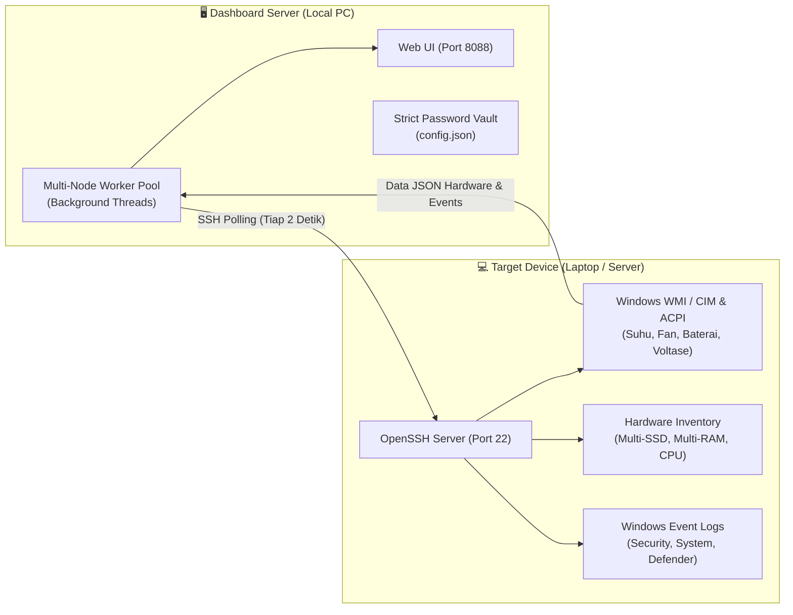

# 🛡️ Panduan Lengkap Integrasi SSH Perangkat Target ke Hardware & Security Dashboard
**Enterprise Agentless Telemetry & Multi-Node Monitoring Gateway**

Dokumen ini adalah panduan teknis langkah-demi-langkah untuk mengaktifkan dan mengonfigurasi akses **OpenSSH** pada perangkat target (Laptop, PC, atau Server berbasis Windows maupun Linux) agar dapat dipantau secara langsung (*agentless*), simultan, dan aman oleh **Hardware & Security Dashboard** (`http://localhost:8088`).

---

## 1. 🏗️ Arsitektur Integrasi SSH Agentless

Dashboard ini bekerja secara **100% Agentless** (tanpa perlu menginstal software agent pihak ketiga di perangkat target).



### Keunggulan Metode Ini:
- **Zero-Footprint**: Tidak membebani target dengan agent yang memakan resource CPU/RAM.
- **Data Asli Langsung dari Sumber**: Mengambil data sensor fisik WMI/ACPI dan Security Audit Event Log bawaan OS target.
- **Keamanan Maksimal**: Password dilindungi *Strict Vault* (full dots, anti-copy) atau menggunakan *SSH Key-based Authentication*.

---

## 2. 💻 Setup OpenSSH Server pada Target Windows (10 / 11 / Server)

Lakukan langkah-langkah berikut **pada laptop / PC target** yang ingin dipantau:

### ⚡ Metode Tercepat: Gunakan Script 1-Klik (.BAT)
Kami telah menyediakan file script otomatis yang dapat disalin ke laptop/PC target:

1. **Untuk Mengaktifkan SSH (1-Klik)**:
   - Salin file: [`scripts/setup_target_ssh_1click.bat`](file:///d:/Faris/Github/SEIM/scripts/setup_target_ssh_1click.bat) ke target.
   - **Klik Kanan -> Run as Administrator** (atau klik ganda, script akan otomatis meminta izin UAC).
   - Script akan otomatis menginstal OpenSSH, mengaktifkan service, membuka firewall Port 22, dan langsung menampilkan IP serta username yang harus Anda masukkan ke dashboard.

2. **Untuk Menghapus / Menutup Kembali SSH (1-Klik)**:
   - Jika laptop tidak lagi dipantau, jalankan: [`scripts/uninstall_target_ssh_1click.bat`](file:///d:/Faris/Github/SEIM/scripts/uninstall_target_ssh_1click.bat).
   - Service SSHD akan dimatikan, port 22 firewall ditutup, dan fitur OpenSSH dihapus secara bersih.

---

### 🛠️ Atau Metode Manual (PowerShell Administrator):

Jika Anda ingin menjalankan perintah secara manual satu per satu:

### Langkah 2.1: Buka PowerShell sebagai Administrator
1. Klik tombol **Start** di Windows target.
2. Ketik **PowerShell**, klik kanan pada **Windows PowerShell**, lalu pilih **Run as Administrator**.

### Langkah 2.2: Instalasi & Aktifkan Service OpenSSH Server
Salin dan jalankan perintah PowerShell berikut:

```powershell
# 1. Periksa dan instal fitur OpenSSH Server
Add-WindowsCapability -Online -Name OpenSSH.Server~~~~0.0.1.0

# 2. Atur service sshd agar otomatis berjalan saat Windows booting
Set-Service -Name sshd -StartupType 'Automatic'

# 3. Jalankan service sshd sekarang
Start-Service sshd

# 4. Pastikan status service Running
Get-Service sshd
```

### Langkah 2.3: Buka Port 22 pada Windows Firewall
Jalankan perintah ini agar port SSH (22) tidak diblokir oleh Windows Defender Firewall:

```powershell
New-NetFirewallRule -Name 'OpenSSH-Server-In-TCP' -DisplayName 'OpenSSH Server (sshd)' -Enabled True -Direction Inbound -Protocol TCP -Action Allow -LocalPort 22
```

### Langkah 2.4: Atur PowerShell sebagai Default Shell SSH
Agar script telemetri hardware dashboard dapat dieksekusi dengan cepat dan akurat, atur PowerShell sebagai terminal default OpenSSH:

```powershell
New-ItemProperty -Path "HKLM:\SOFTWARE\OpenSSH" -Name DefaultShell -Value "C:\Windows\System32\WindowsPowerShell\v1.0\powershell.exe" -PropertyType String -Force
```

### Langkah 2.5: Identifikasi IP & Username Target
Jalankan perintah berikut di PowerShell target untuk mencatat informasi koneksi:

```powershell
# Mengetahui username lengkap (Format: HOSTNAME\Username)
whoami

# Mengetahui IP Address lokal target
Get-NetIPAddress -AddressFamily IPv4 | Where-Object { $_.InterfaceAlias -notlike "*Loopback*" -and $_.IPAddress -notlike "169.254.*" } | Select-Object InterfaceAlias, IPAddress
```

> [!NOTE]
> **Catat Informasi Ini:**
> - **IP Target**: Misal `172.16.4.205`
> - **Username Target**: Misal `laptop-69pj06ep\acer` atau cukup `acer`
> - **Password**: Password login Windows akun tersebut.

---

## 3. 🔐 Best Practice Keamanan: Akun Khusus Monitoring (Least Privilege)

Jika Anda ingin memantau server produksi tanpa menggunakan akun Administrator penuh:

1. Buat akun Windows standar baru khusus pemantau di target:
   ```powershell
   net user monitor_svc "P@ssw0rdKuat123!" /add /comment:"Service Account Monitoring Hardware Dashboard"
   ```
2. Masukkan akun tersebut ke grup pembaca log dan metrik (tanpa hak admin):
   ```powershell
   # Hak membaca Windows Event Log & Audit Keamanan
   Add-LocalGroupMember -Group "Event Log Readers" -Member "monitor_svc"

   # Hak membaca Performance Counter & Sensor Hardware
   Add-LocalGroupMember -Group "Performance Monitor Users" -Member "monitor_svc"
   ```

---

## 4. 🔑 Setup SSH Key-Based Authentication (Tanpa Password) — Opsional

Untuk keamanan kelas enterprise yang tidak ingin menyimpan password:

1. Di komputer **Dashboard Server**, buat SSH Key (jika belum ada):
   ```bash
   ssh-keygen -t ed25519 -f C:\Users\USER\.ssh\id_ed25519_dashboard -N ""
   ```
2. Salin isi public key (`C:\Users\USER\.ssh\id_ed25519_dashboard.pub`).
3. Pada **laptop target**, buka file:
   - Jika akun standar: `C:\Users\<username>\.ssh\authorized_keys`
   - Jika akun admin: `C:\ProgramData\ssh\administrators_authorized_keys`
4. Tempelkan isi public key ke file tersebut, lalu atur hak aksesnya di target:
   ```powershell
   icacls "C:\ProgramData\ssh\administrators_authorized_keys" /inheritance:r /grant "Administrators:F" /grant "SYSTEM:F"
   ```
5. Masukkan path private key pada profil perangkat di dashboard (`key_path`).

---

## 5. 🐧 Setup pada Target Linux / Ubuntu Server

Jika perangkat target adalah mesin Linux (Ubuntu / Debian / CentOS):

1. Buka terminal di server Linux target:
   ```bash
   sudo apt update
   sudo apt install -y openssh-server lm-sensors
   sudo systemctl enable --now ssh
   ```
2. Buka port 22 di firewall UFW:
   ```bash
   sudo ufw allow 22/tcp
   ```
3. Cek IP server Linux:
   ```bash
   hostname -I
   ```

---

## 6. 🌐 Mendaftarkan Perangkat Target di Hardware Dashboard

Setelah OpenSSH di target aktif dan dapat dijangkau di jaringan:

1. Buka browser pada komputer dashboard:
   ```text
   http://localhost:8088
   ```
2. Pada bilah tab paling atas, klik tombol **`➕ Tambah Profil`** (atau klik ikon ⚙️ pada tab yang sudah ada untuk mengedit).
3. Isi formulir pendaftaran perangkat:
   - **Nama Perangkat**: Nama pengenal (contoh: `Laptop Acer Nitro i5`, `Server Database Lab`).
   - **Jenis Koneksi**: Pilih `SSH_REMOTE`.
   - **Host / IP Target**: Masukkan IP lokal laptop target (contoh: `172.16.4.205`).
   - **Port**: `22`.
   - **Username SSH**: Masukkan username target (contoh: `laptop-69pj06ep\acer` atau `acer`).
   - **Password SSH**: Masukkan password login target.
     *(Input password dilindungi full dots `●●●●●●` dan proteksi anti-copy)*.
   - **Interval Polling**: `2.0` detik.
   - **Aktifkan Monitoring Node**: Centang `[x]`.
4. Klik **"Simpan Profil"**.

---

## 7. ✅ Verifikasi Keberhasilan Koneksi

Setelah disimpan:
1. Tab perangkat baru akan langsung muncul di bar paling atas.
2. Indikator status akan berubah menjadi **`🟢 SSH CONNECTED`** lengkap dengan waktu latensi (misal: `12.4 ms`).
3. **Data Hardware yang Otomatis Terbaca**:
   - **Processor**: Model CPU (misal `i5-13420H`), Cores/Threads, Max Clock, L3 Cache, dan suhu aktual.
   - **RAM Fisik**: Terdeteksi per keping DIMM fisik (misal Slot 1: Team Group 16GB DDR5 + Slot 2: SK Hynix 8GB DDR5).
   - **Penyimpanan**: Terdeteksi setiap disk fisik NVMe/SSD terpisah beserta seluruh partisi drive (C:, D:, E:) dan kapasitas terpakai.
   - **Event Logs**: Streaming langsung event log Windows (Security Audit Event 4624/4672, System, Application, Defender status).
   - **Power**: Status baterai laptop (%) dan voltase charger.

---

## 8. 🛠️ Panduan Troubleshooting (Masalah Umum & Solusi)

| Gejala Masalah | Penyebab Utama | Solusi Penanganan |
|---|---|---|
| **Status "RECONNECTING..." / Merah** | Port 22 terblokir firewall atau IP target salah/berubah. | 1. Pastikan IP target benar (`ipconfig` di target).<br/>2. Tes koneksi dari PC server via cmd: `Test-NetConnection -ComputerName <IP_TARGET> -Port 22`.<br/>3. Jalankan kembali script firewall di Langkah 2.3. |
| **Error "Authentication Failed"** | Username atau password salah, atau format user Windows memerlukan nama hostname. | 1. Pastikan password login target benar.<br/>2. Gunakan format `HOSTNAME\username` (misal: `LAPTOP-69PJ06EP\acer`).<br/>3. Pastikan akun tidak terkunci oleh Windows lockout policy. |
| **IP Target Berubah setelah Laptop Restart** | Laptop mendapatkan IP baru dari DHCP Router. | 1. Cek IP baru via `ipconfig` di laptop.<br/>2. Edit IP di tab dashboard (klik ikon ⚙️).<br/>3. *Saran Terbaik*: Buat **DHCP Static Reservation** di router untuk laptop tersebut agar IP selalu tetap. |
| **Log Security Tidak Terbaca** | Akun SSH yang digunakan bukan Administrator dan belum memiliki izin membaca log keamanan. | Masukkan akun monitoring ke grup bawaan Windows `Event Log Readers` seperti dijelaskan pada Bagian 3. |
| **Koneksi Terputus saat Laptop Sleep / Layar Ditutup** | Laptop masuk mode *Sleep/Hibernate* saat layar ditutup. | Pada laptop target: Buka **Control Panel -> Power Options -> Choose what closing the lid does -> When I close the lid: "Do nothing"**. |

---

## 9. 📞 Bantuan & Pemeliharaan

- **Server Backend**: Dijalankan via `hardware-dashboard/start_hardware_dashboard.bat` (Port 8088).
- **File Konfigurasi**: `hardware-dashboard/config.json`.
- **Log Background Daemon**: Tersedia di direktori sistem IDE antigravity.
