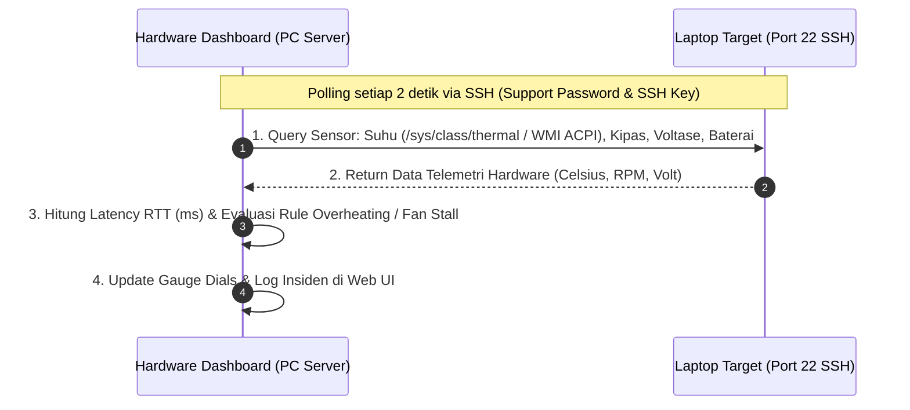

# 🚀 Panduan Setup SSH Laptop Target agar Terbaca di Hardware Dashboard
**RS Indriati Boyolali — IT Infrastructure & Hardware NOC**

Panduan ini dibuat agar Anda dapat menghubungkan **laptop target secara langsung via SSH ke Hardware Monitoring Dashboard (`http://localhost:8088`)** sehingga suhu, kecepatan kipas, voltase, dan status hardware laptop target dapat dipantau secara *real-time* tanpa perlu menginstall agent berat.

---

## 1. 🏗️ Arsitektur Koneksi SSH Hardware Telemetry



---

## 2. 💻 Setup di Laptop Target

Pilih sesuai sistem operasi yang berjalan pada laptop target Anda:

---

### A. Jika Laptop Target Menggunakan Linux / Ubuntu

1. Buka Terminal di laptop target, lalu install OpenSSH Server dan utilitas sensor:
   ```bash
   sudo apt update
   sudo apt install -y openssh-server lm-sensors
   ```

2. Cek alamat IP lokal laptop target:
   ```bash
   hostname -I
   # Contoh hasil: 172.16.4.40
   ```

---

### B. Jika Laptop Target Menggunakan Windows 10 / 11

#### Cara Praktis (1-Click Automation):
1. Salin file script **`scripts/setup_target_ssh_1click.bat`** ke komputer/laptop target.
2. Klik kanan file `setup_target_ssh_1click.bat` -> pilih **"Run as Administrator"**.
3. Tekan Enter untuk port default 22 (atau masukkan port custom jika diinginkan).
4. Script akan otomatis:
   - Mengatasi isu WSUS / 0x80072efd jika Windows Update dikunci.
   - Mengunduh & memasang OpenSSH Server secara otomatis.
   - Memastikan Host Keys ter-generate (`ssh-keygen -A`) dan memperbaiki izin keamanan file (ACL).
   - Membuka firewall Windows & mengaktifkan service `sshd` ke mode *Automatic*.
5. Di akhir proses, script akan langsung menampilkan alamat IP, username, dan port siap pakai.

*(Catatan: Jika ingin menghapus OpenSSH secara total, jalankan script **`scripts/uninstall_target_ssh_1click.bat`**)*.

---

#### Cara Manual (via PowerShell Administrator):
1. Buka **PowerShell as Administrator** di laptop target.
2. Jalankan perintah instalasi OpenSSH Server bawaan Windows:
   ```powershell
   # 1. Install & Aktifkan OpenSSH Server
   Add-WindowsCapability -Online -Name OpenSSH.Server~~~~0.0.1.0
   Start-Service sshd
   Set-Service -Name sshd -StartupType 'Automatic'

   # 2. Buka Port 22 di Firewall Windows
   New-NetFirewallRule -Name 'OpenSSH-Server-In-TCP' -DisplayName 'OpenSSH Server (sshd)' -Enabled True -Direction Inbound -Protocol TCP -Action Allow -LocalPort 22
   ```

3. Cek Username & IP lokal laptop:
   ```powershell
   whoami
   ipconfig
   ```

---

## 3. 🌐 Menghubungkan Laptop ke Hardware Dashboard Web (Menggunakan Password / Key)

Sekarang dashboard sudah mendukung **Input Password Langsung**, sehingga Anda tidak perlu repot menyalin SSH Key jika ingin menggunakan password:

1. **Jalankan Dashboard**:
   - Buka browser ke: **`http://localhost:8088`**
   - *(Jika server belum menyala, klik ganda file `hardware-dashboard/start_hardware_dashboard.bat`)*.

2. **Buka Modal Pengaturan SSH (⚙️)**:
   - Klik tombol ikon **⚙️ (Pengaturan SSH)** di pojok kanan atas web dashboard.
   - Masukkan informasi koneksi laptop Anda:
     - **Alamat IP Target (Host)**: `172.16.4.40`
     - **Username SSH**: Nama user Windows laptop Anda (misal: `acer` atau `laptop-69pj06ep\acer`)
     - **Port SSH**: `22`
     - **Password SSH Laptop**: Masukkan password login laptop Anda di kotak password.
   - Klik tombol **"Simpan & Hubungkan"**.

3. **Selesai!**
   - Indikator koneksi akan langsung berubah menjadi **`🟢 SSH CONNECTED`** lengkap dengan waktu latensi (*RTT Latency ms*).
   - Seluruh gauge meter suhu CPU laptop, voltase baterai/charger, dan spesifikasi laptop target akan langsung berdenyut secara *real-time*!
