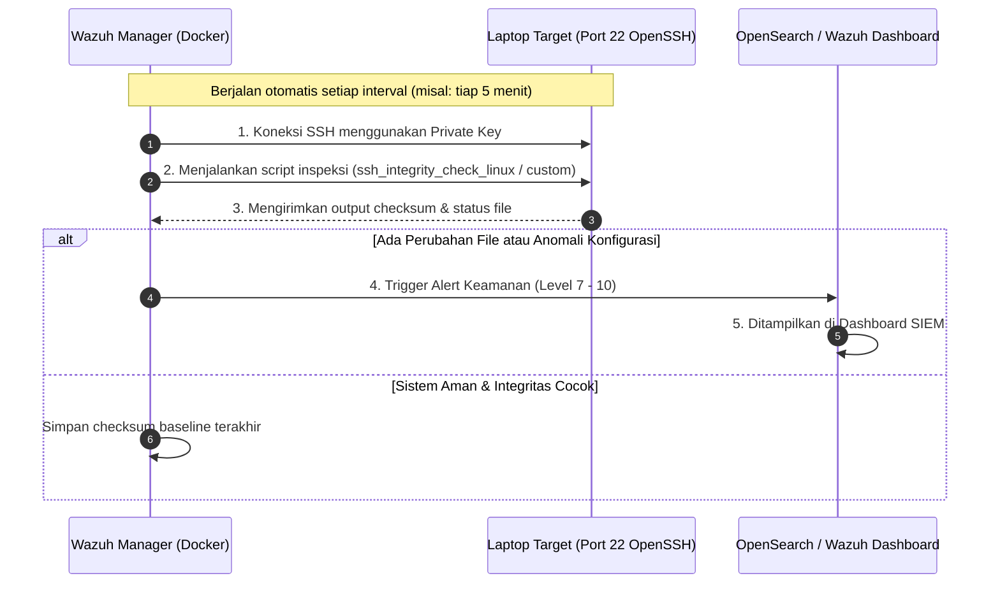

# 🔐 Panduan Praktis: Ujicoba Wazuh Agentless Monitoring via SSH
**RS Indriati Boyolali — IT Infrastructure & Security**

Panduan ini disusun untuk melakukan **pengujian monitoring laptop/server target via SSH tanpa menginstall software `wazuh-agent`** pada laptop tersebut (*Agentless Monitoring*).

---

## 1. 💡 Mengapa Menggunakan Metode Agentless SSH?

| Karakteristik | Metode Agentless SSH | Metode Wazuh Agent Biasa |
|---|---|---|
| **Instalasi di Laptop** | **0% (Tidak perlu install apa pun)** | Harus install service `wazuh-agent` |
| **Beban Resource Laptop** | **Sangat ringan**, hanya aktif saat ada koneksi SSH berkala | Service agent berjalan terus di latar belakang |
| **Kebutuhan Port** | Hanya butuh **Port 22 (SSH)** terbuka | Membutuhkan Port `1514` & `1515` ke Manager |
| **Kesesuaian Target** | Laptop user, router Cisco/MikroTik, appliance firewall, printer server | Server produksi, VM kerja, database server |
| **Kemampuan** | Inspeksi integritas file, audit perubahan konfigurasi, eksekusi command berkala | FIM real-time, Active Response, log streaming instan |

---

## 2. 🏗️ Cara Kerja Wazuh Agentless SSH



---

## 3. 🚀 Langkah Demi Langkah Ujicoba SSH

### Langkah 1: Siapkan Laptop Target (Buka Akses SSH)

#### Jika Target Menggunakan Linux / Ubuntu VM:
Jalankan perintah ini di terminal laptop target (atau gunakan script [`scripts/agentless/setup_target_ssh.sh`](file:///d:/Faris/Github/SEIM/scripts/agentless/setup_target_ssh.sh)):
```bash
# 1. Pastikan OpenSSH Server terpasang
sudo apt update && sudo apt install -y openssh-server

# 2. Buat user khusus monitoring (misal: wazuh_ssh)
sudo useradd -m -s /bin/bash wazuh_ssh
sudo passwd wazuh_ssh

# 3. Pastikan direktori .ssh siap
sudo mkdir -p /home/wazuh_ssh/.ssh
sudo chmod 700 /home/wazuh_ssh/.ssh
```

#### Jika Target Menggunakan Windows 10 / Windows 11:
Buka PowerShell as Administrator di laptop target lalu jalankan:
```powershell
# 1. Pasang & Jalankan OpenSSH Server bawaan Windows
Add-WindowsCapability -Online -Name OpenSSH.Server~~~~0.0.1.0
Start-Service sshd
Set-Service -Name sshd -StartupType 'Automatic'

# 2. Pastikan Firewall mengizinkan Port 22
New-NetFirewallRule -Name 'OpenSSH-Server-In-TCP' -DisplayName 'OpenSSH Server (sshd)' -Enabled True -Direction Inbound -Protocol TCP -Action Allow -LocalPort 22
```

---

### Langkah 2: Buat SSH Key di Wazuh Manager Container

Buka Command Prompt di PC Server (tempat Docker Wazuh berjalan) dan jalankan:

```cmd
:: Masuk ke dalam container wazuh.manager
docker exec -it single-node-wazuh.manager-1 bash

:: Di dalam container, buat direktori .ssh jika belum ada
mkdir -p /var/ossec/.ssh
chown root:ossec /var/ossec/.ssh
chmod 700 /var/ossec/.ssh

:: Generate SSH key pair (tekan Enter tanpa passphrase)
ssh-keygen -t rsa -b 4096 -f /var/ossec/.ssh/id_rsa -N ""

:: Tampilkan public key untuk disalin ke laptop target
cat /var/ossec/.ssh/id_rsa.pub
```

Salin teks Public Key yang muncul, lalu masukkan ke file `/home/wazuh_ssh/.ssh/authorized_keys` (atau `C:\ProgramData\ssh\administrators_authorized_keys` jika target Windows) pada laptop target:
```bash
# Di laptop target Linux:
echo "TEKS_PUBLIC_KEY_DARI_WAZUH" >> /home/wazuh_ssh/.ssh/authorized_keys
chmod 600 /home/wazuh_ssh/.ssh/authorized_keys
```

---

### Langkah 3: Konfigurasi Wazuh Manager (`ossec.conf`)

1. Edit konfigurasi Wazuh Manager di dalam container atau template:
   Tambahkan blok berikut di dalam tag `<ossec_config>` pada file `/var/ossec/etc/ossec.conf`:

```xml
<ossec_config>
  <!-- Konfigurasi Agentless Monitoring via SSH -->
  <agentless>
    <type>ssh_integrity_check_linux</type>
    <custom>ssh_generic_diff</custom>
    <frequency>300</frequency>
    <host>wazuh_ssh@IP_LAPTOP_TARGET</host>
    <state>periodic</state>
    <arguments>/bin /etc /sbin</arguments>
  </agentless>
</ossec_config>
```

> **Catatan**: Ganti `IP_LAPTOP_TARGET` dengan alamat IP lokal laptop Anda (misal: `192.168.27.50`).

2. Daftarkan password atau key otentikasi menggunakan utilitas Wazuh:
```bash
docker exec -it single-node-wazuh.manager-1 /var/ossec/agentless/register_host.sh add wazuh_ssh@IP_LAPTOP_TARGET NOPASS
```

3. Restart Wazuh Manager untuk menerapkan konfigurasi:
```cmd
docker exec -it single-node-wazuh.manager-1 /var/ossec/bin/wazuh-control restart
```

---

### Langkah 4: Verifikasi Hasil Pemeriksaan SSH di Wazuh

1. Cek log aktivitas Agentless di Wazuh Manager:
```cmd
docker exec -it single-node-wazuh.manager-1 tail -f /var/ossec/logs/ossec.log | grep agentless
```
2. Buka browser: **`https://localhost`** (Wazuh Dashboard).
3. Buka menu **Security events** &rarr; filter dengan kata kunci `agentless`.
4. Anda akan melihat log event pemeriksaan integritas file dan status koneksi SSH dari laptop target tercatat rapi tanpa pernah menginstall `wazuh-agent` di laptop tersebut!

---

## 4. 📁 Ringkasan Skrip Helper

Semua script pembantu telah disiapkan di folder [`scripts/agentless/`](file:///d:/Faris/Github/SEIM/scripts/agentless/):
- [`scripts/agentless/setup_target_ssh.sh`](file:///d:/Faris/Github/SEIM/scripts/agentless/setup_target_ssh.sh): Script setup otomatis untuk target Linux.
- [`scripts/agentless/setup_target_ssh_windows.ps1`](file:///d:/Faris/Github/SEIM/scripts/agentless/setup_target_ssh_windows.ps1): Script setup otomatis untuk target Windows OpenSSH.
- [`scripts/agentless/wazuh_agentless_template.xml`](file:///d:/Faris/Github/SEIM/scripts/agentless/wazuh_agentless_template.xml): File template XML konfigurasi siap copy-paste.
- [`scripts/agentless/test_ssh_agentless.bat`](file:///d:/Faris/Github/SEIM/scripts/agentless/test_ssh_agentless.bat): Pengujian konektivitas port 22 ke laptop target.
