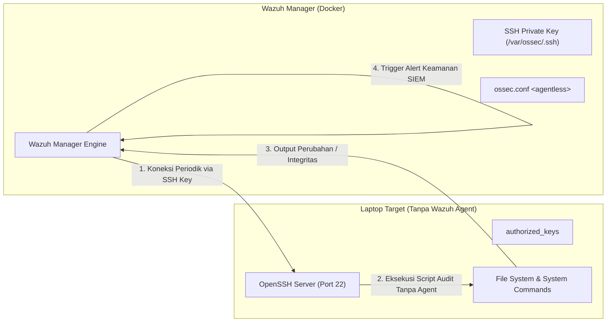
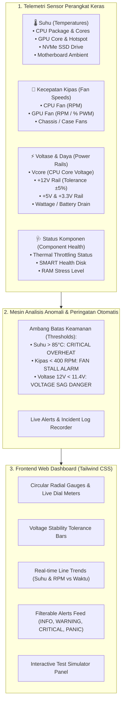

# [Plan 2026-09-04-01] Rencana Implementasi: Ujicoba Wazuh Agentless SSH & Dedicated Hardware Monitoring Dashboard

**Tanggal Dibuat**: 04 September 2026  
**Nomor Rencana**: `2026-09-04-01`  
**Status**: Menunggu Review Pengguna (Pending Approval)

Dokumen rencana ini dibuat dengan penomoran dan tanggal terstruktur (**`2026-09-04-01`**) untuk menjawab dua kebutuhan baru:
1. **Ujicoba Wazuh Agentless Monitoring via SSH** pada laptop/target machine (memantau laptop **tanpa menginstall Wazuh Agent**).
2. **Pembuatan Folder Baru Berisi Dedicated Hardware Monitoring Dashboard** (Frontend: HTML + Vanilla CSS + Tailwind CSS) dengan fitur spesifik:
   - **Hardware Monitoring**: Memantau Suhu (*Temperatures*), Kecepatan Kipas (*Fan Speeds/RPM*), Voltase (*Voltages & Power Rails*), dan Status Komponen secara *real-time*.
   - **Alerts & Logs**: Mengirimkan peringatan otomatis (*automated incident warnings*) jika terjadi anomali/masalah pada perangkat keras.

---

## 📌 1. Prinsip & Pemisahan Peran Sistem

- **Wazuh SIEM**: Tetap berjalan di Docker (`https://localhost`) sebagai pusat audit keamanan, log kejadian, dan pemeriksaan integritas SSH Agentless.
- **Hardware Dashboard Baru**: Ditempatkan di folder baru [`hardware-dashboard/`](file:///d:/Faris/Github/SEIM/hardware-dashboard/) dan berjalan sebagai web application mandiri yang ringan, responsif, berestetika modern (*Cyber Dark Mode Glassmorphism* dengan Tailwind CSS), serta dilengkapi simulator sensor interaktif.
- **Mode Plug & Play**: Hardware Dashboard akan menyertakan server telemetri Python mandiri dengan dukungan *Dual-Mode* (membaca sensor riil sistem bila tersedia, dan fallback mode simulasi interaktif agar langsung bisa dicoba di laptop mana pun tanpa driver khusus).

---

## 🏗️ 2. Bagian I: Arsitektur & Prosedur Ujicoba SSH (Wazuh Agentless Monitoring)

### 2.1 Konsep Agentless Monitoring di Wazuh
Pada sistem Agentless, laptop/perangkat target tidak memerlukan instalasi service `wazuh-agent`. Sebagai gantinya:
- Wazuh Manager (di dalam Docker) secara periodik melakukan koneksi SSH terenkripsi ke target menggunakan **SSH Key Pair**.
- Wazuh Manager mengeksekusi script audit ringan bawaan (`ssh_integrity_check_linux`, `ssh_generic_diff`, atau custom script) untuk mendeteksi perubahan file penting, konfigurasi sistem, atau output perintah terminal.
- Jika ada anomali atau perubahan integritas, Wazuh SIEM membunyikan alarm keamanan.



### 2.2 Tahapan Implementasi Ujicoba SSH:
1. **Persiapan Target (Laptop/VM)**:
   - Mengaktifkan OpenSSH Server (`sshd`) di laptop target (Linux atau Windows OpenSSH).
   - Membuat user monitoring khusus (misal: `wazuh_ssh`) dan memasang Public Key.
2. **Konfigurasi Wazuh Manager**:
   - Menghasilkan SSH Key Pair di container `wazuh.manager`.
   - Menambahkan blok `<agentless>` pada konfigurasi `/var/ossec/etc/ossec.conf`:
     ```xml
     <agentless>
       <type>ssh_integrity_check_linux</type>
       <custom>ssh_generic_diff</custom>
       <frequency>300</frequency>
       <host>wazuh_ssh@IP_LAPTOP_TARGET</host>
       <state>periodic</state>
       <arguments>/bin /etc /sbin</arguments>
     </agentless>
     ```
3. **Penyediaan Helper & Guide**:
   - Dibuatkan panduan langkah demi langkah bergambar di [`docs/panduan_ujicoba_ssh_agentless.md`](file:///d:/Faris/Github/SEIM/docs/panduan_ujicoba_ssh_agentless.md) dan script bantu koneksi di [`scripts/agentless/`](file:///d:/Faris/Github/SEIM/scripts/agentless/).

---

## 🎨 3. Bagian II: Dedicated Hardware Monitoring Dashboard (HTML + CSS + Tailwind)

### 3.1 Fitur Utama Hardware Dashboard
Berbeda dengan dashboard SIEM umum, dashboard ini dirancang khusus untuk **Sensor & Telemetri Fisik Hardware**:



### 3.2 Rincian Tampilan & Komponen UI (Tailwind CSS + Glassmorphism)
Dashboard akan mengusung estetika **Cyber Dark Mode / Enterprise NOC** dengan warna HSL Tailwind yang elegan:
1. **Header & System Overview Bar**:
   - Hostname, CPU Model, GPU Model, Uptime, Power Source (AC/Battery), dan Status Kebugaran Menyeluruh (*All Systems Nominal* / *Warning* / *Critical*).
2. **Suhu Monitor (Temperature Gauges)**:
   - Gauge meter dinamis untuk CPU (°C), GPU (°C), dan Storage (°C) dengan warna adaptif (Hijau `<65°C`, Kuning `65-80°C`, Merah `>80°C`).
   - Indikator deteksi *Thermal Throttling*.
3. **Kecepatan Kipas (Fan Speed Meters)**:
   - Tachometer animasi RPM kipas CPU, GPU, dan Chassis beserta persentase PWM (0-100%).
   - Indikator peringatan jika kipas berhenti mendadak (*Fan Stall / Fan Failure*).
4. **Voltase & Stabilitas Daya (Voltage Rail Matrix)**:
   - Visualisasi bar toleransi tegangan standar ATX/Motherboard:
     - `+12.0V Rail` (Range aman: `11.40V - 12.60V`)
     - `+5.0V Rail` (Range aman: `4.75V - 5.25V`)
     - `+3.3V Rail` (Range aman: `3.135V - 3.465V`)
     - `CPU Vcore` (Tegangan core dinamis)
5. **Peringatan Otomatis & Log Insiden (Alerts & Logs Feed)**:
   - Feed log real-time dengan filter tingkat keparahan (*ALL, INFO, WARNING, CRITICAL*).
   - Banner pop-up audio/visual saat terjadi *Hardware Overheat* atau *Voltage Drop*.
6. **Interactive Simulator Toolbar**:
   - Tombol pengujian instan untuk mendemokan sistem peringatan:
     - 🔘 *Simulate Overheating (Suhu naik ke 92°C)*
     - 🔘 *Simulate Fan Failure (Kipas berhenti ke 0 RPM)*
     - 🔘 *Simulate Voltage Drop (12V drop ke 10.8V)*
     - 🔘 *Reset to Normal Baseline*

---

## 📁 4. Rencana Perubahan Berkas (Proposed File Structure)

Semua komponen baru akan dibuat secara terisolasi dan rapi:

### 4.1 Dokumentasi & Panduan
- [`docs/plans/2026-09-04_01_plan_ssh_agentless_dan_hardware_dashboard.md`](file:///d:/Faris/Github/SEIM/docs/plans/2026-09-04_01_plan_ssh_agentless_dan_hardware_dashboard.md)
  - Dokumen rencana lengkap bernomor dan bertanggal yang disimpan permanen di repositori.
- [`docs/panduan_ujicoba_ssh_agentless.md`](file:///d:/Faris/Github/SEIM/docs/panduan_ujicoba_ssh_agentless.md)
  - Panduan teknis pengujian koneksi SSH Agentless Wazuh ke laptop tanpa install agent.

### 4.2 Folder Baru: Hardware Monitoring Dashboard (`hardware-dashboard/`)
- [`hardware-dashboard/index.html`](file:///d:/Faris/Github/SEIM/hardware-dashboard/index.html)
  - Tampilan frontend HTML5 + Tailwind CSS dengan tata letak grid responsif, kartu telemetri suhu, gauge kipas, rail voltase, dan live alert feed.
- [`hardware-dashboard/app.js`](file:///d:/Faris/Github/SEIM/hardware-dashboard/app.js)
  - Logika JavaScript frontend: koneksi data real-time, kalkulasi status kesehatan, audio/visual alerts, pembaruan grafik dinamis, dan kontrol simulator.
- [`hardware-dashboard/styles.css`](file:///d:/Faris/Github/SEIM/hardware-dashboard/styles.css)
  - Styling kustom Tailwind: efek glassmorphism, glow neon, animasi putaran tachometer kipas, dan transisi bar toleransi voltase.
- [`hardware-dashboard/server.py`](file:///d:/Faris/Github/SEIM/hardware-dashboard/server.py)
  - Server Python mandiri (port `8088`) yang menyajikan web dashboard dan menyediakan API endpoint JSON (`/api/hardware-metrics`, `/api/alerts`, `/api/simulate`).
- [`hardware-dashboard/start_hardware_dashboard.bat`](file:///d:/Faris/Github/SEIM/hardware-dashboard/start_hardware_dashboard.bat)
  - Script 1-klik untuk langsung menyalakan server dan membuka dashboard di browser secara otomatis.
- [`hardware-dashboard/README.md`](file:///d:/Faris/Github/SEIM/hardware-dashboard/README.md)
  - Panduan penggunaan singkat khusus dashboard hardware.

### 4.3 Skrip Bantu SSH Agentless
- [`scripts/agentless/setup_target_ssh.sh`](file:///d:/Faris/Github/SEIM/scripts/agentless/setup_target_ssh.sh)
  - Skrip bantu konfigurasi OpenSSH user dan permission pada Linux/Ubuntu target.
- [`scripts/agentless/setup_target_ssh_windows.ps1`](file:///d:/Faris/Github/SEIM/scripts/agentless/setup_target_ssh_windows.ps1)
  - Skrip bantu konfigurasi OpenSSH Server pada Windows target.
- [`scripts/agentless/wazuh_agentless_template.xml`](file:///d:/Faris/Github/SEIM/scripts/agentless/wazuh_agentless_template.xml)
  - Template blok konfigurasi XML untuk disisipkan ke `ossec.conf` Wazuh Manager.
- [`scripts/agentless/test_ssh_agentless.bat`](file:///d:/Faris/Github/SEIM/scripts/agentless/test_ssh_agentless.bat)
  - Skrip uji konektivitas SSH dari host ke target.

---

## 🧪 5. Rencana Verifikasi (Verification Plan)

### A. Pengujian Dashboard Hardware:
1. **Eksekusi Launcher**: Jalankan [`hardware-dashboard/start_hardware_dashboard.bat`](file:///d:/Faris/Github/SEIM/hardware-dashboard/start_hardware_dashboard.bat).
2. **Pemeriksaan Web Browser**:
   - Pastikan web terbuka otomatis di `http://localhost:8088`.
   - Periksa apakah 4 panel utama (Suhu, Kipas, Voltase, Komponen) memuat data dengan animasi halus dan responsif.
3. **Pengujian Peringatan Otomatis (Alerts & Logs)**:
   - Klik tombol **"Simulate Overheating"** → pastikan banner CRITICAL muncul dan log mencatat insiden suhu berlebih.
   - Klik tombol **"Simulate Fan Failure"** → pastikan alarm stall kipas berbunyi/berkedip merah.
   - Klik **"Reset Baseline"** → pastikan status kembali hijau (*All Systems Nominal*).

### B. Pengujian Konsep SSH Agentless:
1. Jalankan script uji koneksi SSH ke target machine.
2. Pastikan otentikasi SSH Key berhasil tanpa prompt password.
3. Verifikasi respon eksekusi script inspeksi dari Wazuh Manager.
