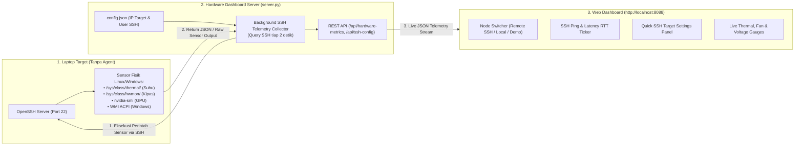

# [Plan 2026-09-04-02] Rencana Implementasi: Integrasi Langsung Remote SSH Sensor ke Hardware Monitoring Dashboard

**Tanggal Dibuat**: 04 September 2026  
**Nomor Rencana**: `2026-09-04-02`  
**Status**: Menunggu Review Pengguna (Pending Approval)

Dokumen rencana bernomor dan bertanggal (**`2026-09-04-02`**) ini merinci arsitektur dan langkah kerja untuk **mengintegrasikan Hardware Monitoring Dashboard secara langsung dengan remote SSH ke laptop target**:

---

## 📌 1. Prinsip & Keunggulan Desain

- **Dual-Source Telemetry (Fleksibel & Multi-Target)**:
  Dashboard akan memiliki fitur **Node Switcher** di bagian atas UI yang memungkinkan Anda berpindah target pemantauan kapan saja secara langsung dari web browser:
  1. **`📡 Remote SSH Laptop Target`** (Memantau telemetri sensor laptop Anda via koneksi SSH Port 22).
  2. **`💻 Local Host PC`** (Memantau PC host saat ini).
  3. **`🧪 Interactive Simulator`** (Mode uji respon alarm).
- **Tanpa Dependency Tambahan**:
  Integrasi SSH di [`hardware-dashboard/server.py`](file:///d:/Faris/Github/SEIM/hardware-dashboard/server.py) memanfaatkan OpenSSH Client bawaan sistem operasi (Windows 10/11 & Linux) sehingga tidak memerlukan instalasi library python eksternal (*Zero-Dependency & Plug & Play*).

---

## 🏗️ 2. Arsitektur Integrasi SSH Sensor Telemetry



---

## 📋 3. Rincian Peningkatan Komponen

### 3.1 File Konfigurasi Target SSH ([`hardware-dashboard/config.json`](file:///d:/Faris/Github/SEIM/hardware-dashboard/config.json))
File konfigurasi JSON sederhana yang bisa diubah manual atau langsung dari web:
```json
{
  "source_mode": "SSH_REMOTE",
  "ssh": {
    "host": "192.168.27.50",
    "port": 22,
    "user": "wazuh_ssh",
    "key_path": "",
    "poll_interval_seconds": 2.0
  },
  "local": {
    "poll_interval_seconds": 2.0
  }
}
```

### 3.2 Peningkatan Backend ([`hardware-dashboard/server.py`](file:///d:/Faris/Github/SEIM/hardware-dashboard/server.py))
- **Remote SSH Collector Engine**:
  - Mengirim perintah sensor ringan ke target via SSH:
    - Target Linux: Membaca thermal zones `/sys/class/thermal/`, data kipas `/sys/class/hwmon/`, beban CPU `/proc/stat`, dan GPU `nvidia-smi`.
    - Target Windows: Menjalankan remote CIM query ACPI / WMI via OpenSSH.
  - Menghitung **Round-Trip Time (RTT latency)** koneksi SSH (ms).
  - Menangani status jika laptop target sleep atau terputus dengan indikator `SSH Disconnected - Reconnecting...`.
- **API Endpoints Baru**:
  - `GET /api/hardware-metrics`: Mengembalikan telemetri live dari sumber yang aktif (Remote SSH / Local).
  - `GET /api/ssh-config`: Membaca konfigurasi koneksi SSH saat ini.
  - `POST /api/ssh-config`: Memperbarui IP target, user, atau port SSH langsung dari Web UI tanpa harus restart server.

### 3.3 Peningkatan Frontend UI ([`hardware-dashboard/index.html`](file:///d:/Faris/Github/SEIM/hardware-dashboard/index.html) & [`app.js`](file:///d:/Faris/Github/SEIM/hardware-dashboard/app.js))
- **Header Node Selector**:
  - Tombol dropdown untuk memilih:
    - 📡 **Remote SSH Target** (`192.168.27.50` &bull; Latency: `3ms` &bull; Connected)
    - 💻 **Local Host Machine**
    - 🧪 **Interactive Simulation**
- **Modal Pengaturan SSH**:
  - Tombol ikon roda gigi (⚙️) di header untuk membuka panel pengaturan cepat:
    - Input Alamat IP Laptop Target
    - Input Username SSH
    - Tombol **"Test & Connect SSH"** dengan indikator status hijau/merah seketika.

---

## 📁 4. Rencana Perubahan Berkas (Proposed Changes)

### 4.1 Berkas Rencana & Dokumentasi
- [`docs/plans/2026-09-04_02_plan_integrasi_ssh_hardware_dashboard.md`](file:///d:/Faris/Github/SEIM/docs/plans/2026-09-04_02_plan_integrasi_ssh_hardware_dashboard.md)
  - Dokumen rencana bernomor dan bertanggal `2026-09-04-02`.
- [`hardware-dashboard/README.md`](file:///d:/Faris/Github/SEIM/hardware-dashboard/README.md)
  - Pembaruan panduan penggunaan fitur Remote SSH Telemetry.

### 4.2 Berkas Backend & Konfigurasi
- [`hardware-dashboard/config.json`](file:///d:/Faris/Github/SEIM/hardware-dashboard/config.json)
  - Berkas konfigurasi default sumber telemetri dan parameter koneksi SSH.
- [`hardware-dashboard/server.py`](file:///d:/Faris/Github/SEIM/hardware-dashboard/server.py)
  - Penambahan modul SSH Poller, dynamic remote query parser, RTT latency calculator, dan endpoint konfigurasi `/api/ssh-config`.

### 4.3 Berkas Frontend UI
- [`hardware-dashboard/index.html`](file:///d:/Faris/Github/SEIM/hardware-dashboard/index.html)
  - Penambahan Node Selector di topbar, badge latency SSH RTT, dan Modal dialog konfigurasi SSH.
- [`hardware-dashboard/app.js`](file:///d:/Faris/Github/SEIM/hardware-dashboard/app.js)
  - Penanganan pergantian node telemetri secara live, pengiriman update konfigurasi SSH ke API, dan visualisasi latency connection bar.
- [`hardware-dashboard/styles.css`](file:///d:/Faris/Github/SEIM/hardware-dashboard/styles.css)
  - Styling modal dialog glassmorphism dan badge status koneksi SSH.

---

## 🧪 5. Rencana Verifikasi (Verification Plan)

1. **Uji Koneksi Backend SSH**:
   - Jalankan script pengujian pembacaan sensor remote via SSH.
   - Pastikan parser telemetri mampu mengonversi output remote Linux/Windows menjadi payload JSON standar.
2. **Uji Frontend Web Dashboard**:
   - Buka `http://localhost:8088`.
   - Ganti mode ke **Remote SSH Node** melalui dropdown header.
   - Buka modal pengaturan SSH (⚙️) dan ubah IP laptop target, lalu klik **"Test & Save"**.
   - Pastikan dashboard langsung memperbarui data sensor dengan hostname dan suhu dari laptop target.
3. **Uji Respon Failover (Koneksi Putus)**:
   - Coba masukkan IP yang tidak aktif &rarr; pastikan dashboard menampilkan badge peringatan `SSH Disconnected` secara anggun tanpa crash.
