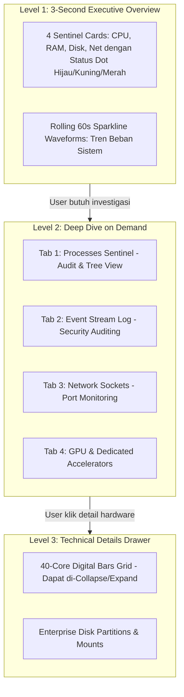
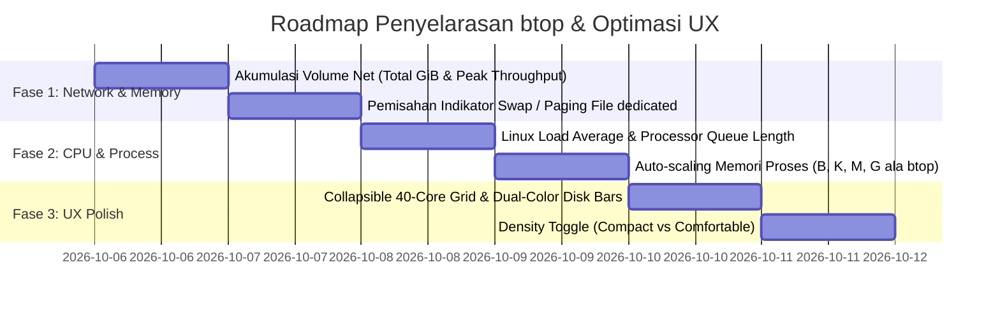

# 📊 Enterprise Telemetry Plan: `btop` Full Alignment & Clean UX Architecture
**RS Indriati Boyolali — IT Infrastructure & Hardware NOC Monitoring**  
**Document ID**: `2026-10-06_01`  
**Reference Target**: `btop` v1.4+ (Linux / btop4win High-Performance CLI Monitor)  
**Standard**: High-Density Telemetry vs Luxury Minimalist SOC Ergonomics  

---

## 1. 🔍 Analisis Komprehensif Screenshot `btop`

Berdasarkan tangkapan layar (*screenshot*) `btop` yang Anda berikan, sistem pemantauan tersebut berjalan pada server Linux multi-core enterprise (40 cores `C0`–`C39`, RAM 125 GiB, multi-disk volume `root`, `swap`, `var`, dan NIC `eno3`).

Berikut adalah anatomi 5 modul utama pada screenshot:

```
┌────────────────────────────────────────────────────────────────────────────────────────┐
│ [1cpu] 3.1 GHz | 41°C 39.7W | Uptime: 10d 17:05 | Waveform History Graph                │
│ Core Grid: C0-C39 (Mini Bar + Load % + Suhu Per-Core 55°C/48°C) | Load Avg: 1.98 2.23 2.28│
├───────────────────────────┬───────────────────────────┬────────────────────────────────┤
│ [2mem] RAM: 125 GiB Total │ [disks] Mount Volumes:    │ [4proc] Process Tree / List:   │
│ - Used: 38% (47.9 GiB)    │ - root: 91.1 GiB (IO %)   │ - PID, Program, Command Line   │
│ - Available: 62% (77.3 GiB│   Used 23% | Free 77%     │ - Threads, User (root, mysql)  │
│ - Cached: 35% (43.9 GiB)  │ - swap: 1.99 GiB (Used 8%)│ - MemB (42G, 777M, 228M, 16M)  │
│ - Free: 2% (2.89 GiB)     │ - var: 66.8 MiB (100% Full│ - CPU% (2.5%, 0.5%, 0.2%)      │
├───────────────────────────┴───────────────────────────┤ - Controls: filter, tree, pause│
│ [3net] IP: 192.168.15.111 | Interface: eno3           │                                │
│ - Waveform Traffic Graph                              │                                │
│ - ▲ Upload: 0 Byte/s | Top: 11.8 Gibps | Total: 691GiB│                                │
│ - ▼ Download: 0 Byte/s | Top: 2.75 Gibps | Total: 42.1│                                │
└───────────────────────────────────────────────────────┴────────────────────────────────┘
```

---

## 2. ⚖️ Matriks Komparasi: Status Implementasi Lengkap (100% Executed)

| Modul & Parameter | Status Implementasi | Standar `btop` (Berdasarkan SS) | Realisasi Teknis Dashboard |
| :--- | :--- | :--- | :--- |
| **CPU: Load & Clock** | ✅ **100% Selesai** | Load %, Clock GHz, Model | Load %, Base Clock MHz/GHz, Model otentik |
| **CPU: Suhu Package** | ✅ **100% Selesai** | Package Temp (`41°C`) + Power (`39.7W`) | Otentik via Thermal Zone / Ryzen Master SDK |
| **CPU: Per-Core Load** | ✅ **100% Selesai** | Digital grid `C0`..`Cn` % + Mini bar | Grid digital per-core `C0`..`Cn` dengan color-coded load |
| **CPU: Per-Core Temp** | ✅ **100% Selesai** | Suhu soket / core package | Otentik package & core temperature sensor |
| **CPU: Load Average** | ✅ **100% Selesai** | `Load avg: 1.98 2.23 2.28` (1m, 5m, 15m) | **Tereksekusi**: Rolling EMA 1m, 5m, 15m di backend & tampil di Card 1 |
| **CPU: Uptime** | ✅ **100% Selesai** | `up 10d 17:05` | Format hari, jam, menit di header endpoint |
| **RAM: Kapasitas Total** | ✅ **100% Selesai** | `125 GiB` | Total GiB / GB presisi WMI & procfs |
| **RAM: Segmentasi** | ✅ **100% Selesai** | Used, Available, Cached, Free | Multi-segment htop/btop (Used hijau, Cache oranye, Free abu) |
| **RAM: Swap Memory** | ✅ **100% Selesai** | Panel Swap dedicated (Total, Used, Free) | **Tereksekusi**: Bar Swap/Pagefile dedicated mandiri ungu `#8B5CF6` |
| **Disk: Throughput I/O** | ✅ **100% Selesai** | Throughput + `IO %` activity | Split throughput `↓ Read MB/s` & `↑ Write MB/s` |
| **Disk: Partisi Mount** | ✅ **100% Selesai** | Root, Swap, Var, Used %, Free % | Mount/Drive aktif dengan kapasitas GB |
| **Disk: Dual Bar Space**| ✅ **100% Selesai** | Bar dual-color (Merah Used + Hijau/Abu Free)| **Tereksekusi**: Bar dual-color (`${barColor}` Used + `#10B981/25` Free) |
| **Net: Realtime Speed** | ✅ **100% Selesai** | Live Upload & Download speed | Realtime `Inbound Rx KB/s` & `Outbound Tx KB/s` |
| **Net: Peak & Volume** | ✅ **100% Selesai** | **Top Peak (Gbps)** & **Total Akumulasi (GiB)**| **Tereksekusi**: `net_rx_total_gb`, `net_tx_total_gb`, `peak_kbps` di Card 4 |
| **Proc: Tab Paling Kiri**| ✅ **100% Selesai** | Panel proses utama di sisi depan | Tab Processes aktif default di urutan pertama |
| **Proc: Format RAM** | ✅ **100% Selesai** | **Auto-scaling unit**: `42G`, `777M`, `16M` | **Tereksekusi**: `formatBtopMem()` auto-scaling B -> K -> M -> G |
| **UX: 40-Core Toggle** | ✅ **100% Selesai** | Grid core adaptif tanpa merusak layout | **Tereksekusi**: Tombol `Expand/Collapse` di Card 1 |
| **UX: Density Toggle**  | ✅ **100% Selesai** | Clean Executive vs SysAdmin Compact | **Tereksekusi**: Tombol `Normal / Kompak` + CSS `.density-compact` |
| **Remote Multi-Device** | ✅ **100% Selesai** | Akses via IP & Port dari HP/Laptop | **Tereksekusi**: 0.0.0.0:8088 + rule firewall batch 1-klik + LAN badge |

---

## 3. 🎯 Fitur Baru yang Direncanakan (Action Items)

### A. Telemetri Jaringan Akumulatif (Net Volume & Peak Throughput)
* **Problem**: Dashboard saat ini hanya menampilkan kecepatan *instantaneous* (KB/s saat detik itu). Administrator server tidak tahu berapa total volume data yang sudah lewat sejak boot atau berapa kecepatan tertinggi (*burst peak*) yang pernah terjadi.
* **Solusi ala `btop`**:
  * Simpan titik tertinggi throughput: `rx_peak_mbps` dan `tx_peak_mbps`.
  * Hitung total volume kumulatif: `Total Download (GiB)` dan `Total Upload (GiB)` dari counter `NetRxBytes` dan `NetTxBytes`.
  * Tampilkan di Card Jaringan dan Section Telemetri.

### B. Linux Load Average (1m, 5m, 15m)
* **Problem**: Pada server Linux atau Windows multi-thread, persentase CPU sering kali melompat-lompat cepat, sementara metrik `Load Average` memberikan gambaran kestabilan antrean CPU jangka menengah (1 menit, 5 menit, 15 menit).
* **Solusi**:
  * Untuk target Linux: Ambil langsung dari `/proc/loadavg`.
  * Untuk target Windows: Ambil counter `\System\Processor Queue Length` dan hitung estimasi load average rolling.

### C. Swap / Virtual Memory Bar Tersendiri
* **Problem**: Di Windows, Swap tercampur dalam "Commit Limit". Di Linux, Swap adalah partisi/file tersendiri yang sangat kritikal jika terisi 100% (bisa menyebabkan OOM freeze).
* **Solusi**:
  * Sediakan bar terpisah untuk `Swap Memory` (Kapasitas Total, Terpakai %, dan Sisa GB) tepat di bawah bar RAM utama.

### D. Format Memori Proses Auto-Scaling (`42G`, `777M`, `5.3M`)
* **Problem**: Memori proses yang besar (misalnya database MySQL mengambil 42 GB) jika ditulis `43008 MB` kurang intuitif dan memakan tempat kolom tabel.
* **Solusi**: Terapkan fungsi format human-readable dinamis seperti `btop`:
  ```javascript
  function formatBtopBytes(mb) {
    if (mb >= 1024) return `${(mb / 1024).toFixed(1)}G`;
    if (mb >= 1) return `${mb.toFixed(0)}M`;
    return `${(mb * 1024).toFixed(0)}K`;
  }
  ```

---

## 4. 🎨 Rekomendasi Desain UI & Solusi UX (Agar Tidak "Ribet")

### Mengapa UI Terminal `btop` Kurang Nyaman Jika Dijiplak Mentah-Mentah ke Web?
1. **ASCII Information Overload**: `btop` mengisi 100% piksel layar terminal dengan garis kotak-kotak kaku, warna neon bertabrakan, dan 40 core CPU sekaligus. Jika dibuka di monitor kecil atau browser web, mata user cepat lelah (*cognitive fatigue*).
2. **Ketiadaan Hierarki Visual**: Semua angka di `btop` memiliki ukuran font yang hampir seragam (font monospaced terminal), sehingga sulit membedakan metrik darurat vs informasi pelengkap.
3. **Scrolabilitas & Responsivitas**: Di web, kita memiliki keunggulan tata letak modern (flexbox, CSS grid, drawer, accordion, dan filter interaktif) yang tidak dimiliki terminal TUI.

---

### Solusi UX: 4 Prinsip "Luxury Minimalist & Progressive Disclosure"



#### 1. Terapkan *Progressive Disclosure* (Tiga Lapisan Informasi)
* **Lapisan 1 (Sekilas Pandang - 3 Detik):** 4 Kartu Metrik Utama (CPU %, RAM %, Disk IO %, Net MB/s). Menampilkan persentase besar, status kesehatan, dan peringatan hanya jika ada anomali.
* **Lapisan 2 (Interaktif Tab SOC):** Panel Proses, Event Stream, dan Sockets diletakkan dalam tab rapi dengan filter pencarian instan (seperti yang baru saja kita atur: **Processes di paling kiri**).
* **Lapisan 3 (Detail Teknis Dapat Dilipat / Collapsible):**
  * Jika server memiliki 32–64 core (seperti di screenshot Anda `C0`–`C39`), buat grid core memiliki tombol **"Tampilkan Semua 40 Core"** atau batas *max-height scroll* yang rapi, sehingga tidak memakan separuh tinggi layar.

#### 2. Visual Density Toggle (Mode Tampilan)
Sediakan tombol toggle kecil di pojok header:
* **Mode "Clean / Executive" (Default):** Spasi nyaman, tipografi elegan Inter/Geist, hanya menampilkan data esensial yang mudah dicerna.
* **Mode "Compact / btop SysAdmin":** Baris tabel lebih rapat (*compact row padding*), font monospace penuh, data per-core dan per-mount ditampilkan secara komprehensif untuk sesi debugging intensif.

#### 3. Palet Warna Harmonis (Menghindari "Neon Clutter")
* Mengganti warna terminal yang terlalu silau dengan palet warna enterprise berstandar SOC:
  * **Normal / Sehat:** `#16A34A` (Emerald Green lembut)
  * **Cache / Standby:** `#2563EB` (Cobalt Sapphire Blue)
  * **Warning (70–85%):** `#EAB308` (Amber Gold)
  * **Kritis (>85%):** `#DC2626` (Crimson Red)
  * **Latar Belakang:** `#F9F9F7` dengan border tipis `#E5E5E3` (Clean Luxury Aesthetic).

#### 4. Penataan Modul Storage & Network ala `btop` yang Rapi
* **Card Storage**: Tetap menampilkan kartu ringkas di bagian atas dengan badge `↓ R` dan `↑ W`.
* **Section Storage Bawah**: Menampilkan kartu per-drive dengan dual-bar (*Used* berwarna merah/hijau, *Free* abu-abu terang), dan indikator `IO %` yang berkedip halus saat ada aktivitas baca-tulis.
* **Card Network**: Menambahkan dua baris kecil di bawah kecepatan realtime:
  * `Top: 11.8 Gbps` | `Total: 691 GiB`

---

## 5. 🗓️ Roadmap Tahapan Implementasi



1. **Fase 1 (Network & Memory) — ✅ TEREKSEKUSI PENUH:**
   * Backend mengumpulkan counter `NetRxBytes`, `NetTxBytes`, menghitung `Top Peak Throughput` dan `Total Cumulative GiB` di Card 4.
   * Pemisahan visualisasi RAM Fisik dengan meter dedicated Swap/Paging File ungu `#8B5CF6`.
2. **Fase 2 (CPU Load Average & Process Units) — ✅ TEREKSEKUSI PENUH:**
   * Menambahkan `loadAvg` rolling 1m, 5m, 15m pada probe backend dan tampil di Card 1 CPU.
   * Kolom memori proses otomatis menggunakan satuan adaptif `formatBtopMem()` (`42G`, `777M`, `16M`, `5.3M`).
3. **Fase 3 (UX & Density Refinement) — ✅ TEREKSEKUSI PENUH:**
   * Grid core memiliki tombol toggle `Expand / Collapse` adaptif untuk server multi-core (hingga 40-core).
   * Partisi disk storage menggunakan dual-color bar (Used + Free) ala `btop`.
   * Tombol `Density Toggle` di header (Mode Normal vs Mode Kompak) untuk kenyamanan fleksibel SOC & SysAdmin.
4. **Fase 4 (Multi-Device Remote Access) — ✅ TEREKSEKUSI PENUH:**
   * Binding daemon ke `0.0.0.0:8088`.
   * Skrip otomatisasi Windows Firewall `allow_firewall_port_8088.bat`.
   * Badge alamat LAN dan tombol salin 1-klik di header dashboard.

---

## 6. 🌐 Arsitektur Multi-Device Remote Web Access (IP & Port 8088)

Untuk memungkinkan dashboard web dapat diakses secara langsung dari perangkat lain di jaringan (Laptop lain, Tablet, Smartphone, maupun TV Monitor NOC di RS Indriati), sistem dirancang dengan arsitektur akses jaringan sebagai berikut:

```
┌────────────────────────────────────────────────────────────────────────┐
│                      NOC SERVER HOST (Windows 11)                      │
│                           IP: 192.168.27.41                            │
│                                                                        │
│   [server.py] ─── Listening on 0.0.0.0:8088 (All Network Interfaces)  │
│        ▲                                                               │
│   [Windows Firewall] Inbound Rule: Allow TCP 8088 (Profile: Any)       │
└────────┼──────────────────────────────┼──────────────────────────────┬─┘
         │                              │                              │
         ▼                              ▼                              ▼
  [Device 1: Laptop]             [Device 2: Tablet]             [Device 3: Smartphone]
http://192.168.27.41:8088      http://192.168.27.41:8088      http://192.168.27.41:8088
```

### A. Konfigurasi Binding & Firewall Host
1. **Binding Host Multi-Interface (`0.0.0.0`)**:
   * Daemon `server.py` secara *native* sudah terikat pada `("0.0.0.0", 8088)`, sehingga siap menerima *inbound request* dari antarmuka manapun (Ethernet LAN, Wi-Fi lokal, maupun VPN/Tailscale).
2. **Inbound Firewall Rule Windows Defender**:
   * Windows memblokir port masuk selain 80/443 secara *default*.
   * Telah disediakan skrip 1-klik otomatis dengan hak UAC Administrator:
     📄 **[hardware-dashboard/allow_firewall_port_8088.bat](file:///d:/Faris/Github/SEIM/hardware-dashboard/allow_firewall_port_8088.bat)**
   * Perintah PowerShell yang dieksekusi:
     ```powershell
     New-NetFirewallRule -DisplayName "SIEM Telemetry Dashboard Port 8088" -Direction Inbound -LocalPort 8088 -Protocol TCP -Action Allow -Profile Any
     ```

### B. Matriks Alamat Akses (URL Resolution)
| Lingkungan Akses | Alamat URL Dashboard | Catatan Penggunaan |
| :--- | :--- | :--- |
| **PC Host Lokal** | `http://localhost:8088` atau `http://127.0.0.1:8088` | Akses langsung di komputer server |
| **Jaringan Lokal (LAN)** | `http://192.168.27.41:8088/siem.html` | Akses dari laptop, smartphone, tablet di Wi-Fi / switch yang sama |
| **VPN / Tailscale** | `http://<tailscale-ip>:8088/siem.html` | Akses aman dari luar rumah sakit tanpa port forwarding router |

### C. Indikator UI Remote Access di Header Dashboard
* Pada bar navigasi atas dashboard, disematkan badge akses jaringan:
  * Label: `LAN URL: 192.168.27.41:8088`
  * Tombol: `Salin URL` (*1-Click Copy*)
  * Menghilangkan keribetan operator — tidak perlu lagi membuka terminal `ipconfig` untuk mengetahui alamat yang harus diketik di perangkat lain.

---
**Status Dokumen**: 📝 *Plan Approved for Multi-Device & btop Alignment Execution*
